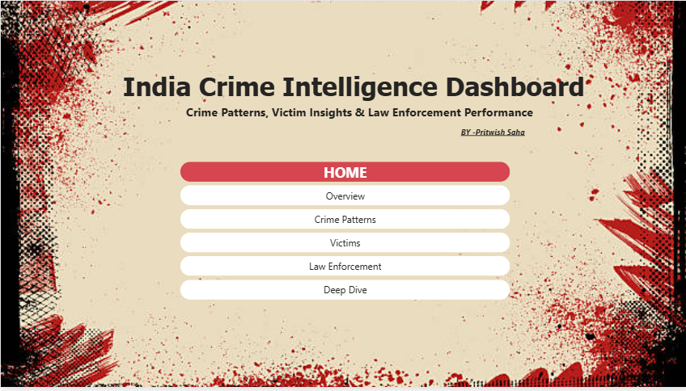
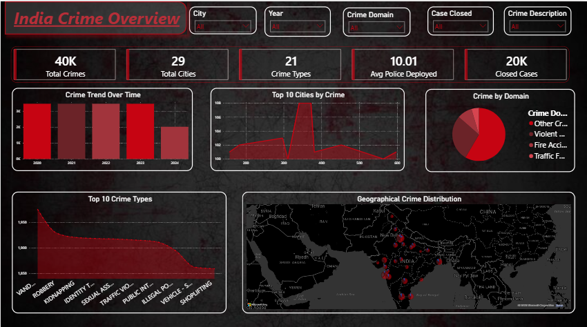
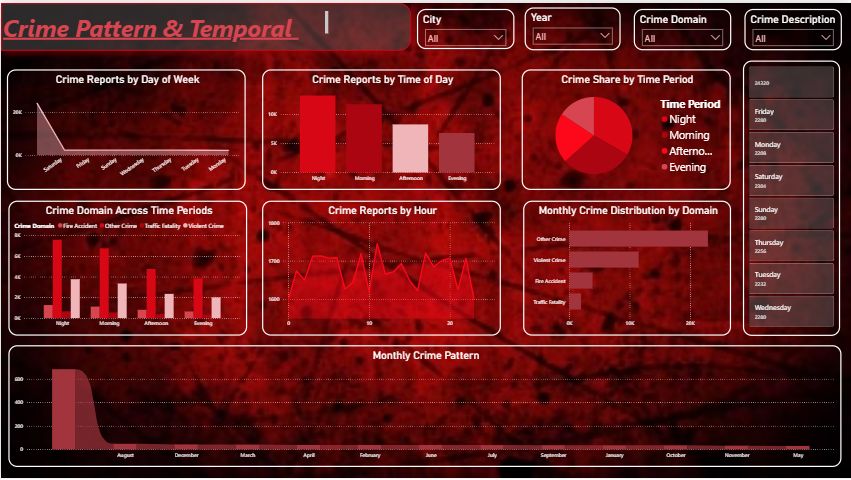
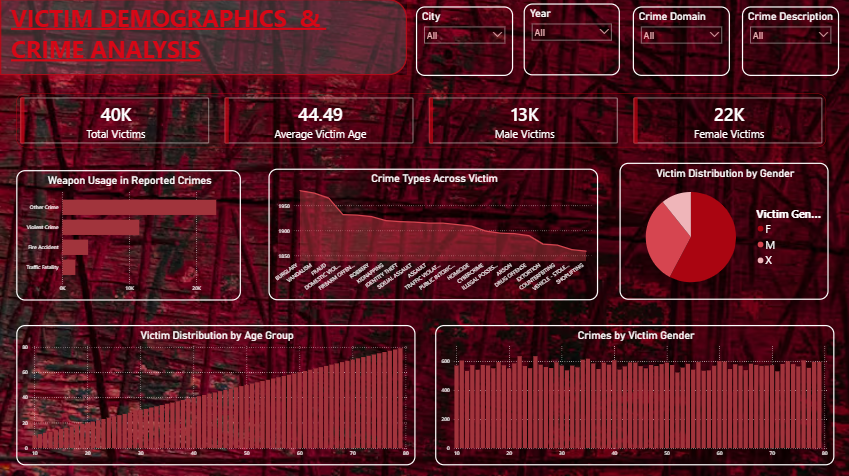
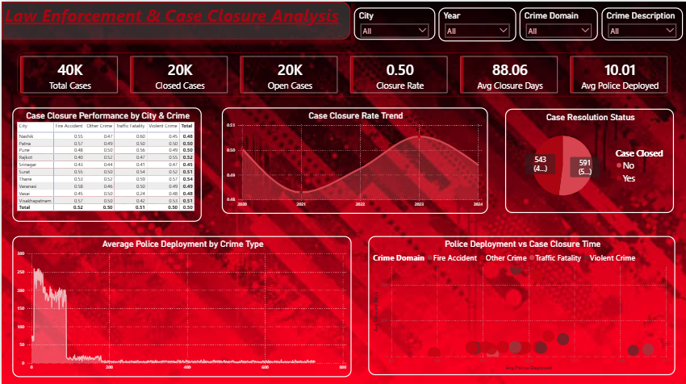
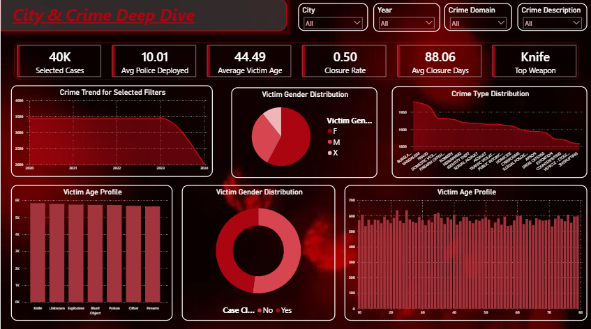

# 🕵️ India Crime Intelligence Dashboard

### Crime Patterns • Victim Insights • Law Enforcement Performance

<p align="center">
  
  
  
  
</p>

<p align="center">
  <b>An interactive Power BI dashboard for exploring crime patterns, victim demographics, geographic hotspots, and case-closure performance across Indian cities.</b>
</p>

---

## 📸 Dashboard Preview

<p align="center">
  
</p>
<p align="center">
  
</p>
<p align="center">
  
</p>
<p align="center">
  
</p>
<p align="center">
  
</p>
<p align="center">
  
</p>
---

## 📌 Project Overview

**India Crime Intelligence Dashboard** is an end-to-end data analytics project built with **Power BI** to analyze crime records across Indian cities.

The dashboard transforms raw crime data into an interactive analytical system covering:

* 📊 Crime volume and trends
* 🗺️ Geographic crime distribution
* 🕒 Temporal crime patterns
* 🧍 Victim demographics
* 🔪 Weapon usage
* 🚓 Police deployment
* ✅ Case closure performance
* ⏱️ Case resolution time
* 🏙️ City-level crime analysis

### 📂 Dataset at a Glance

| Metric                  |         Value |
| ----------------------- | ------------: |
| 🗃️ Crime Records       |      **40K+** |
| 🏙️ Cities              |        **29** |
| 🚨 Crime Types          |        **21** |
| 📅 Years                | **2020–2024** |
| 👮 Avg. Police Deployed |     **10.01** |
| ✅ Closed Cases          |      **20K+** |
| 📈 Closure Rate         |      **~50%** |
| ⏱️ Avg. Closure Days    |     **88.06** |

---

# 🧭 Dashboard Navigation

| Page                   | Focus                                       |
| ---------------------- | ------------------------------------------- |
| 🏠 **Home**            | Dashboard navigation & project introduction |
| 📊 **Overview**        | National-level crime statistics             |
| 🕒 **Crime Patterns**  | Temporal & domain-based crime analysis      |
| 🧍 **Victim Analysis** | Victim demographics & weapons               |
| 🚓 **Law Enforcement** | Police deployment & case closure            |
| 🔎 **Deep Dive**       | Interactive city/crime investigation        |

---

# 🏠 01 — Home

The **Home** page acts as the landing page and navigation hub for the entire dashboard.

Users can move between analytical sections and quickly understand the purpose of the project.

<p align="center">
  
</p>

### 🎯 Purpose

* Dashboard navigation
* Project introduction
* Quick access to analytical pages
* Consistent visual theme

---

# 📊 02 — Crime Overview

The **Overview** page provides a high-level picture of crime activity across the dataset.

<p align="center">
  
</p>

### 📌 Key KPIs

> **40K+** Total Crimes
> **29** Cities
> **21** Crime Types
> **10.01** Avg. Police Deployed
> **20K+** Closed Cases

### 📈 Analysis Included

* Crime trends over time
* Top 10 cities by crime volume
* Top crime types
* Crime domain distribution
* Geographic crime distribution across India
* Overall crime concentration

### 🔍 Business Question

**Where is crime concentrated, and how has overall crime activity changed over time?**

---

# 🕒 03 — Crime Patterns & Temporal Analysis

This page focuses on **when crimes occur**.

<p align="center">
  
</p>

### ⏰ Temporal Dimensions

The analysis explores crime according to:

* 📅 Day of week
* 🕐 Time of day
* ⏱️ Hour
* 📆 Month
* 📈 Year

### 🚨 Crime Domains

The dashboard compares:

* 🔴 Violent Crime
* 🔥 Fire Accident
* 🚗 Traffic Fatality
* ⚠️ Other Crime

### 🔍 Key Questions

* Which days experience the highest crime volume?
* Which hours are associated with more incidents?
* Are crimes concentrated during nighttime?
* How do different crime domains behave across time?
* Are there noticeable seasonal patterns?

---

# 🧍 04 — Victim Demographics & Crime Analysis

This page examines the **human impact of crime** through victim demographics and weapon information.

<p align="center">
  
</p>

### 📌 Key KPIs

| Metric                |     Value |
| --------------------- | --------: |
| 👤 Total Victims      |  **40K+** |
| 🎂 Average Victim Age | **44.49** |
| 👨 Male Victims       |  **13K+** |
| 👩 Female Victims     |  **22K+** |

### 📊 Visual Analysis

* Weapon usage frequency
* Crime type by victim
* Victim age distribution
* Gender distribution
* Age-group analysis
* Relationship between crime categories and victim demographics

### 🔍 Key Questions

**Who is most affected by the recorded crimes, and what patterns exist across age, gender, and weapon usage?**

---

# 🚓 05 — Law Enforcement & Case Closure

This page evaluates **case resolution and law-enforcement performance**.

<p align="center">
  
</p>

### 📌 Performance Snapshot

> **40K+** Total Cases
> **20K+** Closed Cases
> **20K+** Open Cases
> **~50%** Closure Rate
> **88.06 days** Avg. Closure Time
> **10.01** Avg. Police Deployed

### 📊 Analysis Included

* Case closure by city
* Closure performance by crime type
* Closure-rate trend
* Open vs closed cases
* Average closure days
* Police deployment analysis
* Police deployment vs closure time

### 🎯 Key Question

**How efficiently are recorded cases being resolved, and where are potential performance gaps visible?**

> ⚠️ **Important:** A correlation between police deployment and closure time should not be interpreted as causation. The dashboard is descriptive rather than a causal evaluation of police effectiveness.

---

# 🔎 06 — City & Crime Deep Dive

The **Deep Dive** page provides granular analysis using interactive filters.

<p align="center">
  
</p>

### 🎛️ Interactive Analysis

Users can filter the dashboard by:

* 🏙️ City
* 📅 Year
* 🚨 Crime Domain
* 🔎 Crime Type

### 📌 Dynamic KPIs

> 👮 **10.01** Avg. Police Deployed
> 🎂 **44.49** Avg. Victim Age
> ✅ **0.50** Closure Rate
> ⏱️ **88.06** Avg. Closure Days
> 🔪 **Knife** Top Weapon

### 📊 Visuals

* Crime trend for selected filters
* Victim gender distribution
* Victim age distribution
* Crime type distribution
* Weapon analysis
* Case-resolution metrics

This page is designed for **drill-down investigation** rather than only high-level reporting.

---

# 💡 Key Insights

### 01 — ⏰ Temporal Concentration

Crime activity is not uniformly distributed throughout the day. Certain days and time periods show noticeably higher incident volumes, with nighttime activity showing a notable spike in this dataset.

### 02 — 🚓 Case Closure

Approximately **50% of recorded cases are closed**, while a similar proportion remains open.

The average recorded closure time is approximately **88 days**.

### 03 — 🧍 Victim Demographics

The dataset contains a higher number of recorded female victims than male victims.

This represents the distribution within **this dataset** and should not automatically be interpreted as a statement about India's overall crime victimization rate.

### 04 — 🔪 Weapon Patterns

**Knife** appears as the most frequently recorded weapon category in the analyzed dataset.

### 05 — 🗺️ Geographic Hotspots

Crime volume varies substantially between cities, allowing potential high-volume locations and geographic concentrations to be identified.

---

# 🧠 Analytical Workflow

```text
                RAW CRIME DATA
                      │
                      ▼
              ┌───────────────┐
              │ Data Cleaning  │
              │ Power Query    │
              └───────┬───────┘
                      │
                      ▼
              ┌───────────────┐
              │ Data Modeling  │
              │ Relationships  │
              └───────┬───────┘
                      │
                      ▼
              ┌───────────────┐
              │ DAX Measures   │
              │ KPI Metrics    │
              └───────┬───────┘
                      │
                      ▼
              ┌───────────────┐
              │ Visualization  │
              │ Maps • Charts  │
              └───────┬───────┘
                      │
                      ▼
             INTERACTIVE REPORT
```

---

# 🛠️ Tools & Technologies

### 📊 Power BI

Used for:

* Interactive dashboard development
* Data modeling
* DAX calculations
* KPI cards
* Slicers
* Drill-through navigation
* Geographic visualization
* Interactive filtering

### 🔄 Power Query

Used for:

* Data cleaning
* Data transformation
* Column preparation
* Data-type handling
* Removing unnecessary data
* Preparing the dataset for analysis

### 📐 DAX

Used to create analytical measures such as:

* Total Crimes
* Closed Cases
* Open Cases
* Closure Rate
* Average Closure Days
* Average Police Deployment
* Average Victim Age
* Dynamic filtered KPIs

---

# 📊 Dashboard Capabilities

| Capability            | Included |
| --------------------- | :------: |
| KPI Cards             |     ✅    |
| Interactive Slicers   |     ✅    |
| Drill-through         |     ✅    |
| Geographic Mapping    |     ✅    |
| Time-Series Analysis  |     ✅    |
| Demographic Analysis  |     ✅    |
| Crime Classification  |     ✅    |
| Case Closure Analysis |     ✅    |
| City-Level Filtering  |     ✅    |
| Dynamic Metrics       |     ✅    |

---

# 🎨 Dashboard Design

The report follows a dark, analytical visual style designed to make high-density information easier to scan.

### Design Principles

* 🌑 Dark dashboard theme
* 📌 KPI-first layout
* 📊 Consistent chart hierarchy
* 🎯 Interactive filtering
* 🗺️ Geographic storytelling
* 🔎 Progressive drill-down
* 📱 Clear visual grouping

---

# 📁 Project Structure

```text
India-Crime-Intelligence-Dashboard/
│
├── 📊 crime_clean_data.csv
│
├── 📈 India_Crime_Intelligence.pbix
│
├── 🖼️ crime_image/
│   ├── HOME.png
│   ├── Overview.png
│   ├── Crime_Patterns.png
│   ├── Victims.png
│   ├── Law_Enforcement.png
│   └── Deep_Dive.png
│
└── 📄 README.md
```

---

# 🎯 Project Objectives

The primary objectives of this project are to:

* Analyze crime patterns across Indian cities
* Identify high-volume crime locations
* Understand temporal crime behavior
* Explore victim demographics
* Analyze weapon usage
* Evaluate case closure performance
* Examine police deployment metrics
* Build an interactive analytical reporting system

---

# 🚀 Future Improvements

Potential extensions to the project include:

* 🤖 Crime-volume forecasting using machine learning
* 🗺️ Advanced hotspot detection
* 📍 Ward-level geographic analysis
* 📈 Predictive case-closure modeling
* 🚨 Crime-risk scoring
* 🔔 Automated anomaly detection
* 🧠 ML-based crime pattern classification
* 🌐 Publishing the dashboard through Power BI Service

---

# ⚠️ Data Interpretation Note

This dashboard is intended for **data analytics and visualization purposes**.

The findings represent patterns contained within the analyzed dataset and should not automatically be interpreted as official crime statistics, causal relationships, or evidence of policing effectiveness.

In particular:

* Crime volume ≠ crime rate unless population exposure is incorporated.
* Correlation ≠ causation.
* Dataset distributions may not represent the entire Indian population.
* Recorded cases may differ from actual crime incidence.

---

# 🙋‍♂️ Author

## **Pritwish Saha**

🎓 **Engineering Student | Data Analytics & Machine Learning**

Interested in:

**Data Analytics • Machine Learning • Power BI • Python • Data Visualization**

---

<p align="center">

### ⭐ If you found this project interesting, consider giving the repository a star!

**Built with 📊 Power BI + 🧠 Data Analytics + 🚓 Crime Intelligence**

</p>
